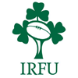

# Ireland Rugby Quiz

View the live project here: https://trxdave.github.io/ireland-rugby-quiz/

# Introduction #
Welcome to the Ireland Rugby Quiz, where your knowledge of Irish rugby will be put to the test! This quiz is designed to challenge your understanding of Ireland's rich rugby history, legendary players, memorable moments, and the intricacies of the sport in the Emerald Isle.

Ireland has a proud rugby tradition, with a passionate fan base and a team that has achieved success on both the national and international stages. From the historic victories in the Six Nations to standout performances in the Rugby World Cup, Ireland has left an indelible mark on the rugby world.

This quiz will cover a range of topics, including the team's achievements, iconic players, memorable matches, and the nuances of the sport. Whether you're a casual fan or a die-hard supporter, this quiz aims to both entertain and test your knowledge of Ireland's rugby prowess.

# Responsive Design #

Using Am I Responsive - website <a href="https://ui.dev/amiresponsive">am i responsive?</a>

So, buckle up, get ready for a journey through the highs and lows of Irish rugby, and let's see how well you know the game on the Emerald Isle!

# Wireframes # 

Before starting to code the game, I used Balsamic to create wireframes, which helped me to design a realistic and achievable game.

Homepage - 

Play Quiz - 

How to Play - 

Result - 

# Built with #

* HTML
* CSS
* JavaScript

# Design #

Colour

The color chosen for this quiz was selected specifically for better readability.

- '#030303' used for primary text.
- '#00744c' used for primary highlights.
- '#ffffff' used for secondary text.

I use ColorZilla to find what is colour on the Irish Rugby website to make it match the colour on my Ireland Rugby Quiz.

<a href="https://chromewebstore.google.com/detail/colorzilla/bhlhnicpbhignbdhedgjhgdocnmhomnp>">ColorZilla</a>

<a href="https://www.irishrugby.ie/>">Irish Rugby Website</a>

# Typograhy #

I use Google Fonts to find what is a suitable font for Ireland Rugby Quiz - <a href="https://fonts.google.com/>">Google Fonts</a>

- [Noto Sans](https://fonts.google.com/noto/specimen/Noto+Sans?query=noto) was used for the primary headers, quesiton and answers.

# Features #

## Before Javascript ##

Before adding Javascript, what do question and answers look like?

## Logo ##

Click on the logo to return to the homepage.

## Home Pages ##

The homepage has a header that displays the title of the quiz, which is "Ireland Rugby Quiz", along with the logo. It also has an image of the Ireland team and provides easy options to play the quiz or to learn how to play it. Additionally, the page includes links to Ireland Rugby's social media accounts and website.

## Game Page ##

Please find below a description of the features available on the game page:

* Showing header of Ireland Rugby Quiz and click on the logo to return to the homepage.

* Display questions with score and countdown in real-time.

* The correct answer is green highlight.

* When an answer is incorrect, it will be displayed in red while the correct answer will be highlighted in green.

* Please click the 'Next' button to move on to the next question.

## Footer ##

* There are two social media accounts for Ireland Rugby on Facebook and Instagram, and their website can be accessed using the globe icon.

## End Page ##

The "End" page shows the final score of the current game.

# Future Features #

My plan future if I revisit Project 2 in a couple of years included 

* Adding more questions
* Video of Ireland Rugby team to say Congratulation on your results!
* Add pictures in question for which stadium?, Who is that players?, etc.
* Add video in question for what will happen next shot the ball or catch the ball?

# Technologies used #

* HTML is a markup language used for structuring content on web pages. - [HTML](https://en.wikipedia.org/wiki/HTML) used for the main site content.
* CSS is a style language used to describe the presentation of HTML. - [CSS](https://en.wikipedia.org/wiki/CSS) used for the main site design and layout.
* CSS Tutorial - [CSS Tutorial](https://www.w3schools.com/css/default.asp) used for how to use and learn.
* [CSS Flexbox Froggy](https://flexboxfroggy.com/) used for flex for an enhanced responsive layout.
* JavaScript is a dynamic functional programming language. - [JavaScript](https://en.wikipedia.org/wiki/JavaScript) used for web development, programming, game development, and more.
* Font Awesome icon library for social links and globe for website. [Font Awesome](https://fontawesome.com/)
* Google Fonts is makes it easy to bring personality and performance to your websites and products. [Google Fonts](https://fonts.google.com/)
* GitHub as software hosting platform that enables users to store their projects in a remote location. This allows for easy access and collaboration on the project from different locations. [GitHub](https://github.com/)
* GitPod as developer hosting platform. [Gitpod](https://www.gitpod.io/)
* Balsamiq wireframes is a user interface design tool for creating wireframes. [Balsamiq Wireframes](https://balsamiq.com/?gad_source=1&gclid=EAIaIQobChMIx7aIzsLVhAMVWJNQBh09fABYEAAYAyAAEgKY0vD_BwE)

# Testing and Validation #

Tested the Ireland Rugby Quiz with Lighthouse, W3C Mark Up Validation, W3C CSS Validation, JSHint, and fixed bugs.

## Lighthouse ##

I have used the recommended [Lighthouse developer chrome](https://developer.chrome.com/docs/lighthouse/overview) to report viewer of my homepages.

Report viewer here - 

## W3C Mark Up Validation ##

I have used the recommended [HTML W3C Validator](https://validator.w3.org) to validate all of my HTML files.

* Home Page - 
* Play Quiz - 
* How to Play - 

## W3C CSS Validation ##

I have used the recommended [HTML W3C CSS Validation](https://jigsaw.w3.org/css-validator/) to validate all of my CSS file.

Report view here - 

## JSHint ##

I using JavaScript file line at the very top of every single JavaScript file /* jshint esversion: 11 */

I have used the recommended [JSHint](https://jshint.com/) to check of my javascript file.

Report view script.js here - 
Report view question.js here - 

# Bugs #

There are two issues Bug

I have fixed bug in issues GitHub. 

# Deployment #

* To create a new repository on GitHub and upload your code, follow these steps: 

    1. Log in to GitHub account.
    2. Click the "New" button to create a new repository.
    3. Give a name to your repository and choose the visibility (public or private).
    4. Add a description if needed.
    5. Select "Initialize this repository with a README" to create a README file for your project.
    6. Add any other files or folders you want to upload to your repository.
    7. Click "Commit changes" to save your changes.
    8. Use the "git push" command to upload your code to the repository.

In my [GitHub repository](https://github.com/trxdave/ireland-rugby-quiz),

The live link can be found [here](https://trxdave.github.io/Ireland-rugby-quiz)
    

# Credits #

Where did I get the question and answer from? - <a href="https://www.sportsjoe.ie/rugby/quiz-well-know-irelands-history-six-nations-209369">Questions</a>

Learn Javascript and all the quiz w3school - <a href="https://developer.mozilla.org/en-US/docs/Web/JavaScript">mdn web docs Javascript</a> and <a href="https://www.w3schools.com/js/default.asp">W3School Javascript</a>

Explanation what is e.target - <a href="https://www.altcademy.com/blog/what-is-e-target-in-javascript/#:~:text=In%20JavaScript%2C%20e%20typically%20stands,click%20or%20a%20keystroke%2C%20happened">e.target</a>

YouTube copy some but different wording - <a href="https://www.youtube.com/watch?v=PBcqGxrr9g8">Youtube</a>

Stack overflow how to get score show - <a href="https://stackoverflow.com/questions/63461753/how-can-i-make-show-score-show-a-text-message-if-certain-amount-of-scores-is-met">Stack Overflow</a>

Ireland Photography image: <a href="https://www.irishrugby.ie/gallery/six-try-ireland-record-comprehensive-win-against-italy/#nanogallery/undefined/0/16">Photo</a>

Ireland Rugby Logo website and download logo from devtools : Homepage: <a href="https://www.irishrugby.ie/">Irish Rugby Website</a> 

Download image from chrome devtools: <a href="https://d19fc3vd0ojo3m.cloudfront.net/irfu/wp-content/uploads/2018/12/06124919/new-logox495_rdax_80.jpg">Image Logo</a>

